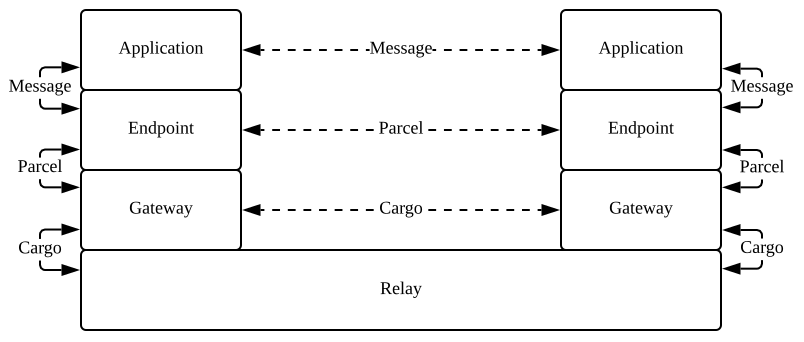

# Implementing a service

A Relaynet service is a collection of applications that communicate amongst themselves in a centralized or decentralized manner. As a Relaynet app developer, you can use this library to send and receive messages serialized in any format (e.g., JSON, ProtocolBuffers) without being concerned about the underlying transport method(s) (e.g., sneakernet, Tor).

If you're unfamiliar with the terminology used in Relaynet, you should start by reading the introduction and the concepts sections from the [core specification](https://specs.relaynet.link/RS-000) to get a high-level understanding of the technology.

## Generating endpoint key pair

Before you're able to send or receive parcels, you have to initialize your endpoint by generating an RSA key pair with [`generateRSAKeyPair()`](./api/globals.html#generatersakeypair) and getting the public key certified:

```javascript
import {
  generateRSAKeyPair,
  issueNodeCertificate,
} from '@relaycorp/relaynet-core';

async function initEndpoint() {
  const { privateKey, publicKey } = await generateRSAKeyPair();
  yourFunctionToSecurelyPersistPrivateKey(privateKey);

  // Self-signing certificate here, but it can/should be issued by the gateway
  const certificate = await issueNodeCertificate({
    issuerPrivateKey: privateKey,
    subjectPublicKey: publicKey,
  });
  yourFunctionToShareCertificate(certificate);
}
```

The private address of your endpoint will be derived from its public key, so depending on the nature of your service you may want to repeat the process above with each endpoint that you communicate with in order to avoid [fingerprinting](https://en.wikipedia.org/wiki/Device_fingerprint).

## Exchanging messages

As shown in the diagram below, each message between two applications is encapsulated as a parcel, so sending and receiving messages involves serializing and deserializing parcels:



For example, consider a centralized service whose applications exchange JSON messages such as the one below:

```json
{
  "message": "Hello world"
}
```

That message could be serialized as a parcel as follows:

```javascript
import { Parcel, ServiceMessage } from '@relaycorp/relaynet-core';

async function serializeMessage() {
  const serviceMessage = new ServiceMessage(
    'application/vdn+acme.message+json',
    Buffer.from(JSON.stringify({ message: 'Hello world' })),
  );
  const parcel = new Parcel(
    'rne+https://acme.com',
    senderCertificate,
    serviceMessage.serialize(),
  );

  return await parcel.serialize(senderPrivateKey, recipientCertificate);
}
```

On the other hand, incoming messages could be deserialized (plus verified and decrypted) as follows:

```javascript
import { Parcel } from '@relaycorp/relaynet-core';

async function deserializeParcel(parcelSerialized) {
  const parcel = await Parcel.deserialize(parcelSerialized);
  // At this point the sender's signature has been verified
  console.log('Received parcel from', parcel.senderCertificate.getCommonName());
  if (parcel.recipient !== 'rne+https://acme.com') {
    throw new Error('Invalid recipient');
  }
  return await parcel.unwrapMessage(recipientPrivateKey);
}
```

### With the Channel Session Protocol

Where possible, you should use the [channel session protocol](https://specs.relaynet.link/RS-003) to exchange messages because that adds perfect forward secrecy, future secrecy and replay attack mitigation. This library hides nearly all the technical details of the protocol, but you're still responsible for securely persisting and retrieving the ephemeral keys until they expire.

This protocol requires the recipient to generate an ephemeral key pair and share the public component before communication begins, in addition to the longer term key already generated above; e.g.:

```javascript
import { generateECDHKeyPair } from '@relaycorp/relaynet-core';

async function generateInitialKeyPair() {
  const { privateKey, publicKey } = await generateECDHKeyPair();
  yourFunctionToSecurelyPersistSessionPrivateKey(privateKey);
}
```

Then the examples above to serialize and deserialize parcels can be rewritten as follows:

```javascript
import { Parcel, ServiceMessage } from '@relaycorp/relaynet-core';

async function serializeMessage() {
  const serviceMessage = new ServiceMessage(
    'application/vdn+acme.message+json',
    Buffer.from(JSON.stringify({ message: 'Hello world' })),
  );
  const parcel = new Parcel(
    'rne+https://acme.com',
    senderCertificate,
    serviceMessage.serialize(),
  );

  const { serialization, dhPrivateKey } = await parcel.serializeWithSession(
    senderPrivateKey,
    recipientPublicKey,
  );
  yourFunctionToSecurelyPersistSessionPrivateKey(dhPrivateKey);
  return serialization;
}

async function deserializeParcel(parcelSerialized) {
  const parcel = await Parcel.deserialize(parcelSerialized);
  // At this point the sender's signature has been verified
  console.log('Received parcel from', parcel.senderCertificate.getCommonName());
  if (parcel.recipient !== 'rne+https://acme.com') {
    throw new Error('Invalid recipient');
  }
  return await parcel.unwrapMessageWithSession(recipientDhPrivateKey);
}
```
